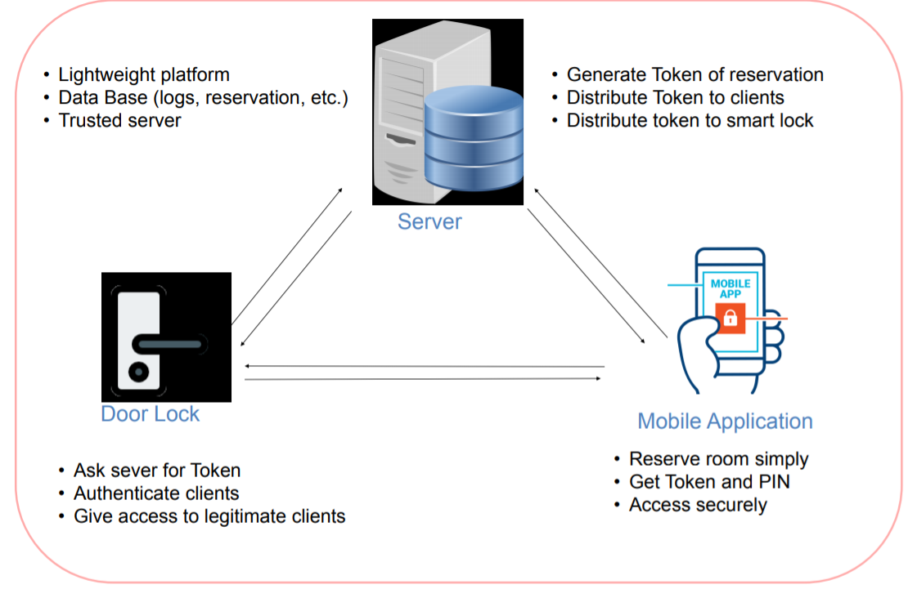
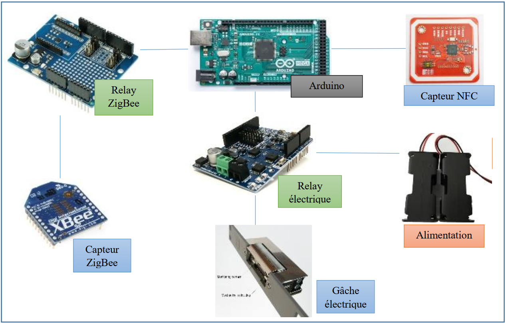
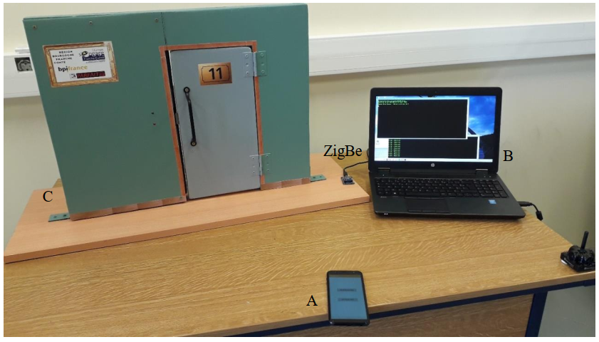
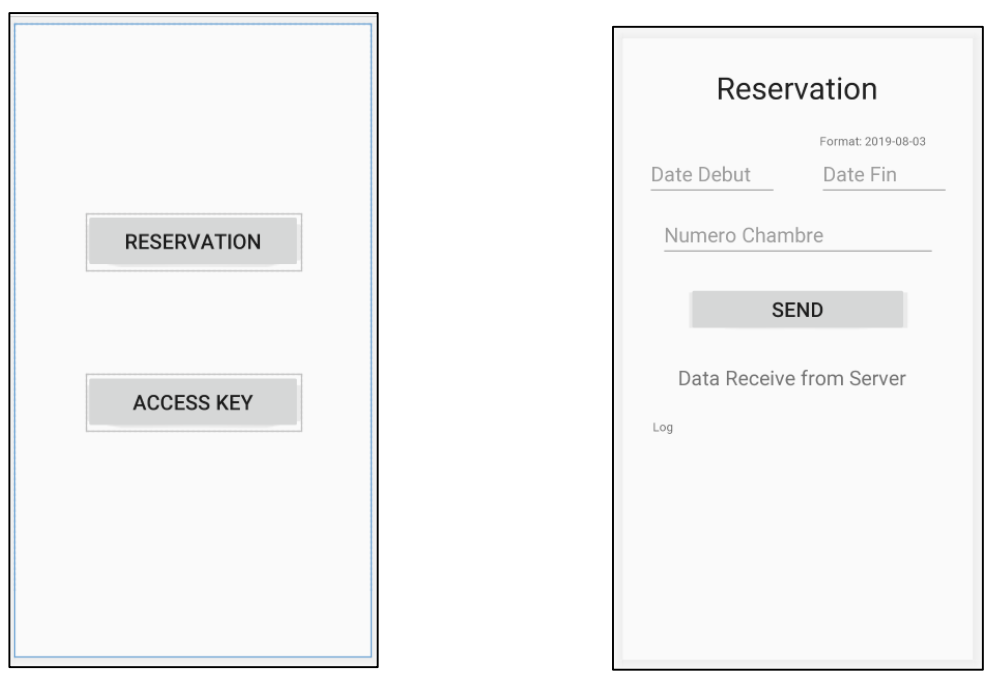
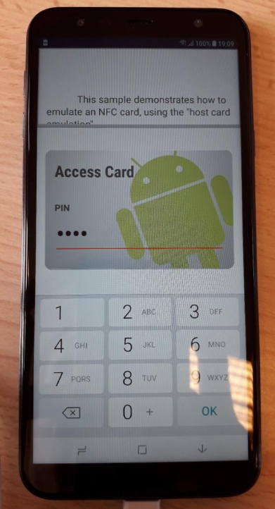
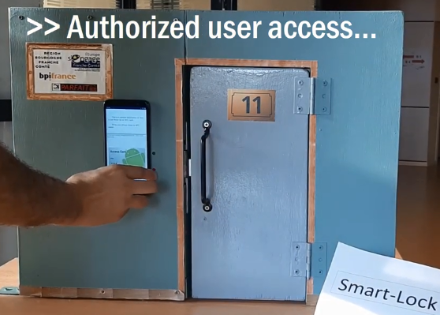
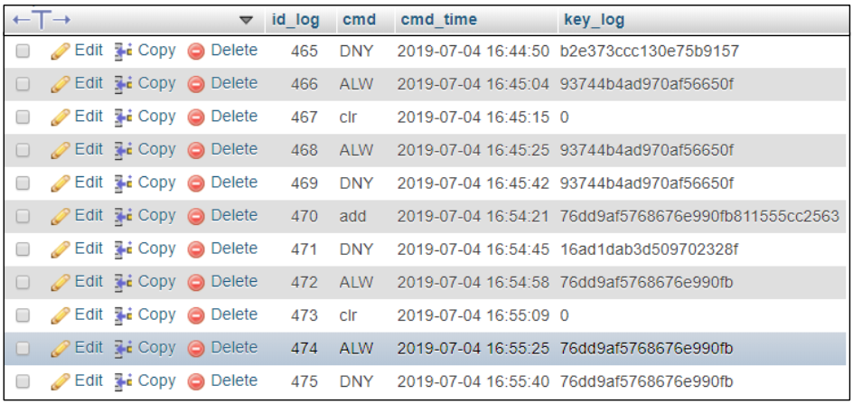

# Smarthotel-PARFAIT
In this project, we propose a pototype of an implementation of a smart hotel use case as part of the European project PARFAT. The project has been developed by the Drive Laboratory and University of Burgundy as a partner of the project PARFAIT.

[](LICENSE)


## Description of the project PARFAIT
PARFAIT (Personal dAta pRotection FrAmework for IoT) project’s main goal is to develop a platform for protecting personal data in Internet of Things applications which will be tested with 2 use-cases. Another goal of the project is to decrease complexity of integrating and deploying services in today’s Internet of Things technology by providing interoperable software libraries, tools and SDK elements.

For more details, please refer to the official website of the PARFAIT project : https://itea3.org/project/parfait.html

## Smart Hotel Use Case Description
This section describes the contributions of the university of Burgundy related to the Smart Hotel demonstrator during the PARFAIT project. The main contributions cover: secure registration, authentication along with secure data exchanges. Nowadays, regular hotels are
equipped with electronic locks. Electronic cards used to grand access need to be personalized and
initialized for each client, which depends on a human operator. The next generation for these locks is Smart/Connected locks, which are able to interact with the local IT systems and communicate with their environment.
Our main objective in this project was the design of a scheme / architecture for access control based on the context with specific security policies in order to provide digital keys / Tokens in order to grant / deny access to smart hotel rooms for end users using their smartphones. A overview about the main excepted goals in this project regarding the smart hotel use case is given the following picture :


## The proposed Architecture
The University of Burgundy has developed a smart hotel system that manage the reservations and access to hotel rooms using mobile phones. The designed system is composed of three main components : the smart-Lock, the reservation server and the android application. Each hotel room is equipped with a smart-lock which is connected to a gateway router through Zigbee technology.
* The reservation server is responsible for handling the reservation demands from end-users. It communicates with local Zigbee servers to intercept the Access Allow/Deny notifications received at the smart-lock level.
* The mobile application is used to book hotel rooms from the reservation server and also to open the smart-lock door using the NFC interface.
* The smart door which is composed of many hardware components. The arduino shield is the most important element in the design of the smart door. It execute some operations to check the validity of tokens received from smartphone to open the door.

The following figure give an idea of the system architecture:



## Smart hotel Features :heavy_check_mark:
* Easy reservation and access to rooms using your personal smartphone.
* The system is lightweight and ensures a secure communication among system entities
* Resist against known attack
* Provide different security features
* Resist man-in-the-Middle attack & Impresonation Attack
* Ensure the perfect forward secrecy
* ... and more

## The main developed applications

### Reservation Server (developed on `JAVA`)
the main features of the reservation system are :
1. interception of end users' reservations demands
2. generation of credentials and tokens for end users
3. management of the mysql reservation database
4. interception of notifications from the smart door

### mobile application (developed on `JAVA`)
the main features of the mobile application are :
1. send reservation demands to the reservation server
2. securely store the received tokens and credentials
3. execute the authentication protocol to open the smart door.

### Smart Lock & Gateway (smart hotel level)
the main features of the mobile application are :
1. handle the smart door opening requests (Access Allow/Deny)
2. authenticate end users using the developed authentication protocol
3. send access notifications (Access Allow/Deny) to the reservation server

## Libraries used
* NFC library for Arduino
* ...

## Technology used
* Python
* JAVA

## Requirements
### softwares
* Python
* JAVA
* MySQL database
### Hardwares
* Ardiuno Mega 2560
* NFC reader module (the used model is PN532) 
* 2 XBee S2 ( arduino XBee adapter and USB XBee adapter)
* Relay Module (Motor Shield Relay MD10)
* Electric Smart Lock
* power batteries support (AA)
* Mobile Phone with NFC reader



## How to use the applications
1. Download the repository files (project) from the download section or clone this project by typing in the bash the following command:

	```
	git clone https://github.com/Drive-Labs/smartHotel-itea3-Parfait.git
	```
2. Open it in your favorite IDE and download the libraries used (montioned above) and add it in the project.
3. Import & execute the SQL queries from the Database folder to the MySQL database.
4. Generate the `apk` from the `MoveUp-mobile-app` folder and install the android application on your smartphone.
5. Run the mobile application
6. Be sure that all the components (mobile phone, Zigbee server, reservation server) can communicate together in local network (or over Internet)
7. Be sure that Zigbee communication is enabled at the smart lock level and the Zigbee server. 
8. Open the terminal and type the command :
	```
	cd server
	```
9. start the Zigbee server by launching the the python scripts using the following commands (using two separate terminals):
	```
	python serverII_27-05-19.py
	python serial_server_09-05-19.py
	```

## Screenshots
In what follows, we show some screenshots of our smart home system and applications:

### Test environment


### Reservation


### Access Control



### Log


## Contributing
If you want to contribute to this project and make it better with new ideas, your pull request is very welcomed.
If you find any issue just put it in the repository issue section, thank you.
