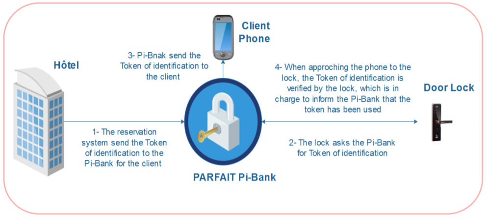

# Smarthotel-PARFAIT
In this project, we propose a pototype of an implementation of a smart hotel use case as part of the European project PARFAT. The project has been developed by the Drive Laboratory and University of Burgundy as a partner of the project PARFAIT.

## Description of the project PARFAIT
PARFAIT (Personal dAta pRotection FrAmework for IoT) project’s main goal is to develop a platform for protecting personal data in Internet of Things applications which will be tested with 2 use-cases. Another goal of the project is to decrease complexity of integrating and deploying services in today’s Internet of Things technology by providing interoperable software libraries, tools and SDK elements.

Interoperability, along with security and privacy of personal data, are the two most important limitations for the growth of the Internet of Things (IoT) market. Interoperability increases the complexity of service production processes and the cost of production. Lack of security and trust for the protection of privacy puts a barrier between service providers and consumers. To solve these issues, PARFAIT aims to develop a platform for protecting personal data in IoT applications and to reduce the complexity of integrating and deploying services in today’s IoT technology by providing interoperable software libraries, tools and SDK elements.

For more details, please refer to the official website of the PARFAIT project : https://itea3.org/project/parfait.html

## Smart Hotel Use Case Description
This section describes the contributions of the university of Burgundy related to the Smart Hotel demonstrator during the PARFAIT project. The main contributions cover: secure registration, authentication along with secure data exchanges. Nowadays, regular hotels are
equipped with electronic locks. Electronic cards used to grand access need to be personalized and
initialized for each client, which depends on a human operator. The next generation for these locks is Smart/Connected locks, which are able to interact with the local IT systems and communicate with their environment.
Our main objective in this project was the design of a scheme / architecture for access control based on the context with specific security policies in order to provide digital keys / Tokens in order to grant / deny access for end users using their smartphones. A overview about the main excepted goals in this project regarding the smart hotel use case is given the following picture :

## The proposed Architecture

## Smart hotel Features :heavy_check_mark:
* Easy reservation and access to rooms using your personal smartphone.
* The system is lightweight and ensures a secure communication among system entities
* Resist against known attack
* Provide different security features
* Resist man-in-the-Middle attack & Impresonation Attack
* Ensure the perfect forward secrecy
*... and more

## The main developed applications

### mobile application
1. Gives a portable solution and H24 work to gain this understanding.
2. ....

### Reservation System
1. Gives a portable solution and H24 work to gain this understanding.
2. ....

### Smart Lock & Gateway (smart hotel level)
1. Gives a portable solution and H24 work to gain this understanding.
2. Automate manual stains.

## Libraries used
* NFC library for Arduino
* ...

## Technology used
* Python
* JAVA

## Requirements
### softwares
* Python
* JAVA
* IDE like Intellij IDEA or other
* MySQL database
### Hardwares
* Ardiuno Mega 2560
* NFC reader module (the used model is PN532) 
* 2 XBee S2 ( arduino XBee adapter and USB XBee adapter)
* Relay Module (Motor Shield Relay MD10)
* Electric Smart Lock
* power batteries support (AA)

## How to use the applications
1. Download the repository files (project) from the download section or clone this project by typing in the bash the following command:

    git clone https://github.com/Drive-Labs/smarthotel-parfait.git
2. Open it in Intellij IDEA and download the libraries used (montioned above) and add it in the project.
3. Import & execute the SQL queries from the Database folder to the MySQL database.
4. Run the application :D

## Screenshots

### Reservation

### Open Smart Lock

### Log

## Contributing
If you want to contribute to this project and make it better with new ideas, your pull request is very welcomed.
If you find any issue just put it in the repository issue section, thank you.
